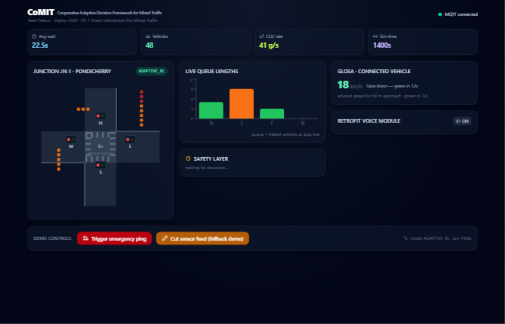
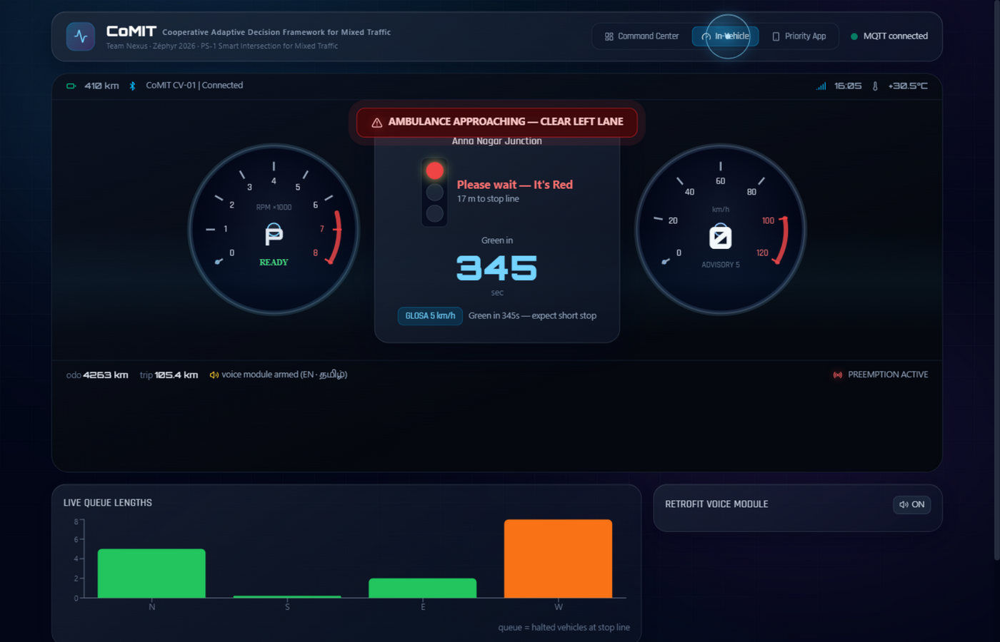
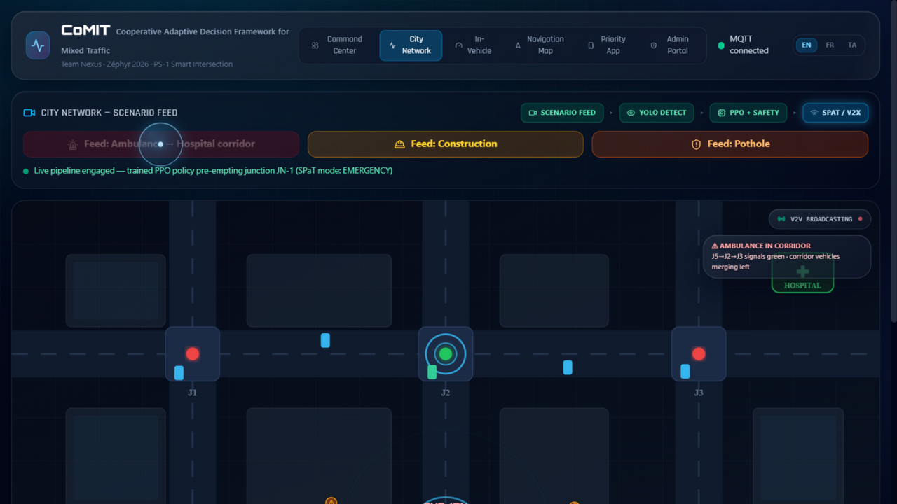
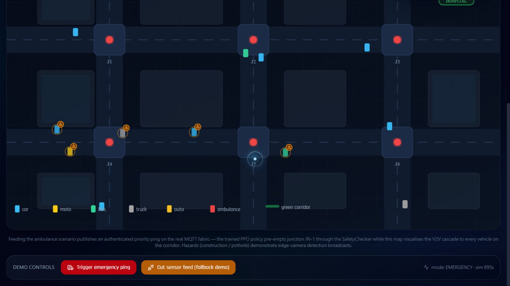
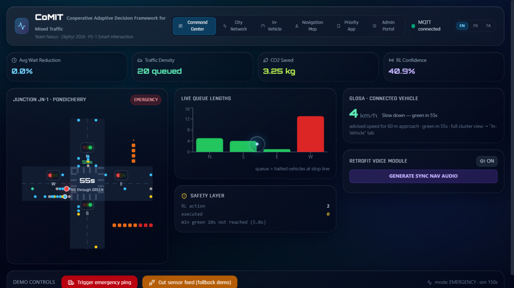

# CoMIT — Project Report
**Cooperative Adaptive Decision Framework for Mixed Traffic**
Team Nexus · Zéphyr 2026 AI Hackathon · Problem Statement PS-1: *Smart Intersection for Mixed Traffic*

---

## 1. What CoMIT is

CoMIT is a **fully software-based, working proof-of-concept** of an intelligent intersection
for Indian mixed traffic. A trained reinforcement-learning controller manages a SUMO
simulation of a 4-way junction; every one of its decisions is vetted by a deterministic
safety layer; emergency vehicles get an authenticated green corridor; and every road user —
connected vehicles, a connected-car instrument cluster, an emergency crew's phone, and
older non-connected vehicles via a retrofit voice module — receives real-time V2X
information over one MQTT fabric (SPaT messages modeled on SAE J2735 / USDOT CARMA-Streets).

Every hardware element in the original concept (Android priority app, ESP32 voice box,
roadside AI camera, GNSS telemetry) has a **1:1 software twin** in this repo, speaking the
exact MQTT topics the physical hardware would use — so the system runs 100% today and each
twin swaps to real hardware without code changes.



## 2. Architecture

```
┌──────────────┐  camera JSON   ┌─────────────────────────────────────┐
│ Vision node  │ ─────────────▶ │            MQTT broker (aedes)      │
│ YOLO11n+BT   │                │   TCP :1883 (services)              │
└──────────────┘                │   WS  :9001 (browser)               │
                                └──────▲───────────────▲──────────────┘
┌──────────────┐  fused state         │ SPaT · alerts │  blips · KPIs
│ SUMO 4-way   │ ─────────────▶ ┌─────┴───────────────┴─────────────┐
│ junction,    │                │        CoMIT core (Python)        │
│ mixed Indian │ ◀───────────── │  PPO policy → SafetyChecker → TLS │
│ traffic      │  phase cmds    │  EmergencyManager (green corridor)│
└──────────────┘                │  ego vehicle + GLOSA + impact calc│
                                └───────┬───────────────┬───────────┘
                     ┌──────────────────┴───┐   ┌───────┴──────────┐
                     │ Dashboard (React)    │   │ ESP32 voice twin │
                     │ Command Center · City│   │ DFPlayer serial  │
                     │ Network map · In-Veh.│   │ logs + audio     │
                     │ Cluster · Priority App│  └──────────────────┘
                     └──────────────────────┘
```

**Modules** (see README.md table for the full file map): perception
(`perception/vision_node.py` — YOLO11n + ByteTrack, per-approach queues, pedestrian
counting, ambulance-livery detection), decision (`train/` PPO via Stable-Baselines3),
safety (`core/safety_checker.py`), emergency corridor (`core/emergency.py`),
V2X (`v2x/`), digital-twin dashboard (`dashboard/`), orchestration (`scripts/run_demo.py`).

## 3. The trained decision model

- **Environment**: custom Gymnasium env over SUMO TraCI. State (14-dim): per-approach
  queue lengths, cumulative wait, phase one-hot, elapsed green, ambulance-within-300 m flag.
  Actions: keep phase / switch to 4 protected green groups. Reward:
  −Σwaiting − α·stops − β·emergency-delay.
- **Training**: PPO (Stable-Baselines3), 120k steps on 4 parallel SUMO instances.
- **Benchmark** (1,300 veh/h, 3 × 15-min episodes, seed-fixed):

| Metric | Fixed-time | Max-pressure | **PPO (CoMIT)** |
|---|---|---|---|
| Avg waiting time | 74.8 s | 79.9 s | **59.0 s (−21%)** |
| Avg queue length | 17.1 | 24.4 | **9.2 (−46%)** |
| CO₂ emissions | 22.7 kg | 29.4 kg | **10.9 kg (−52%)** |

## 4. Innovation keys — what is new, what it is for

| # | Innovation | What it is | What it's for |
|---|---|---|---|
| 1 | **Safety-first RL** | Deterministic `SafetyChecker` between the RL brain and the signal: conflict matrix, min/max green, yellow+all-red clearance, pedestrian interval every 4 cycles, strict action schema (fuzz-verified), 3 s sensor watchdog → fixed-time fallback | Lets an AI control a *safety-critical* signal without any possibility of conflicting greens — the hard blocker for real RL traffic deployment |
| 2 | **Authenticated green corridor** | SHA-256 token-authenticated priority ping → ETA model → pre-empt green *through* the safety layer (min-green overridden, conflict rules never) → `STOP_AND_CLEAR_LANE` broadcast → camera/lane verification → automatic RL restore | Ambulances lose minutes at Indian junctions; this cuts corridor crossing to seconds while proving the AI "breaks rules" only in audited, safe ways |
| 3 | **1:1 software twins for all hardware** | Android app → Priority App tab; ESP32+DFPlayer voice box → simulator with real serial-style logs + audio; roadside camera → YOLO11n node on real traffic footage | The entire product is demonstrable and testable with zero hardware, and each device drops in with zero software changes |
| 4 | **Standards-based V2X** | SAE J2735-shaped SPaT (event_state 3/6/8, min_end_time) over MQTT, matching USDOT CARMA-Streets schema; GLOSA advisory-speed feed from a live simulated ego vehicle | Not a toy protocol — plausibly deployable message format for real RSUs |
| 5 | **In-vehicle digital cluster** | A Kia/Audi-style instrument cluster rendering live SPaT: signal name, "Please wait — It's Red — Green in Ns", distance to stop line, GLOSA advisory speed | The driver-facing face of V2I — the exact screen the deck promised connected vehicles |
| 6 | **Scenario-feed city map** | A 6-junction network where feeding a scenario (ambulance / construction / pothole) drives the *real* trained pipeline and shows the V2V cascade: junctions flip green ahead of the ambulance, every corridor vehicle gets a warning badge | Turns "AI + V2X" from an abstract claim into a visible, judge-triggerable event chain |
| 7 | **Mixed-traffic realism** | SUMO junction with motorcycles (34%), auto-rickshaws, buses, trucks; camera node handles the COCO "no auto-rickshaw" gap and counts pedestrians in the crosswalk band | PS-1 is explicitly about *Indian* mixed traffic, not generic cars |

## 5. Verification & QA (all executed on this machine)

- **Safety fuzz** (`scripts/test_qa.py`): 300 adversarial actions (garbage, floats,
  strings, hostile timings, forged emergencies) → 100% normalized/blocked, zero unsafe
  executions. Found and fixed a real schema-coercion bug in the process.
- **SUMO stress**: densities 0.5 → 2.0, live TLS state scanned every second —
  **zero conflicting-green frames** at any density.
- **V2X latency injection**: 300 ms artificial delay on the whole outbound stream →
  episode safe, emergency chain intact.
- **Unit tests**: 12/12 SafetyChecker invariants (`scripts/test_safety.py`).
- **End-to-end**: realtime demo with camera node, ego vehicle, dashboard —
  ping → auth → PREEMPT → voice → lane-verified → RL restore, observed live on MQTT.





## 6. Running it

```bash
python -m venv .venv && .venv\Scripts\pip install -r requirements.txt
.venv\Scripts\python scripts\run_demo.py --mode ppo --scenario emergency --realtime --camera --dashboard --open
```

One command starts: MQTT broker → SUMO junction (1× pace) → PPO controller →
SafetyChecker → camera edge node → ego connected vehicle → dashboard at
http://localhost:5173. The dashboard's **Stop simulation** button halts everything
gracefully over the same command channel (`v2x/cmd/stop`).

## 7. Known limitations & roadmap

- COCO-pretrained YOLO11n has no auto-rickshaw class — fine-tune path documented
  (Roboflow *Traffic-Indian-Vehicles*, IDD-Detection).
- Single junction; the City Network map visualises a corridor but only JN-1 is
  RL-controlled — multi-agent control (sumo-rl PettingZoo) is the natural next step.
- 24/7 hosting requires a always-on machine for SUMO — see DEPLOYMENT.md.


